# Модель прецедентів

## Діаграми прецедентів бізнес акторів

**Діаграма прецидентів _(діаграма use case_)** - діаграма, що показує різноманітні сценарії взаємодії 
між акторами (користувачами) та прецидентами (випадками використання). [[1]]((https://lvivqaclub.blogspot.com/2008/10/use-case-uml-diagram.html)) [[2]](https://dou.ua/forums/topic/40575/)

### Діаграма use case для всіх бізнес акторів

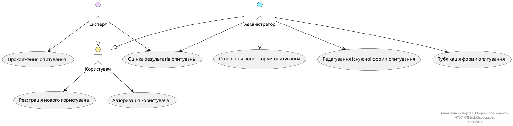

### Діаграма use case для Користувача

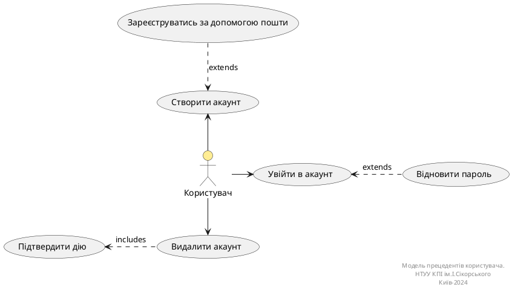

### Діаграма use case для Адмiну

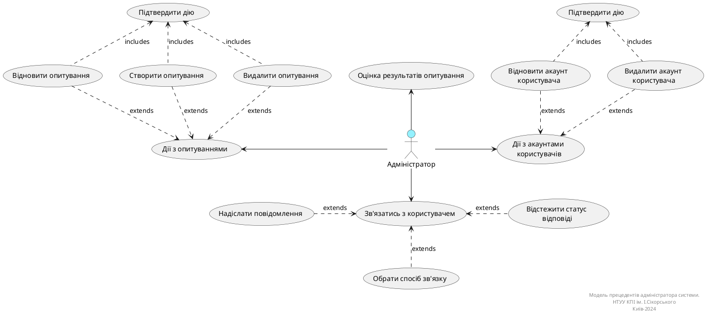

### Діаграма use case для Експерта

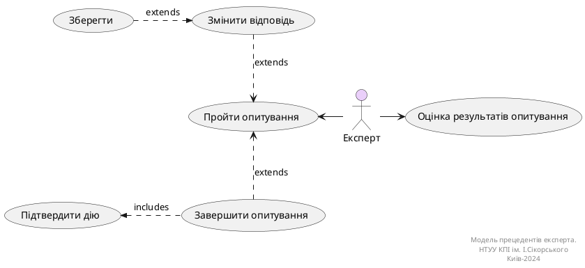

## Діаграми діяльностей

### Процес 1: Реєстрація нового користувача
| Поле                | Значення                                                                                  |
|---------------------|-------------------------------------------------------------------------------------------|
| **ID**              | userRegistration                                                                         |
| **Назва**           | Реєстрація нового користувача                                                            |
| **Учасники**        | Користувач (Адміністратор, Експерт), Система                                                                      |
| **Передумови**      | - Користувач не має облікового запису.   - Користувач має доступ до інтерфейсу реєстрації. |
| **Результат**       | Користувач успішно зареєстрований у системі.                                            |
| **Виключні ситуації**| Exception 1.1 - Неправильні або неповні дані.  Exception 1.2 - Проблеми з сервером.  Exception 1.3 - Користувач вже зареєстрований. |
| **Основний сценарій** | 1. Користувач відкриває форму реєстрації.  2. Вводить ім'я, прізвище, email та пароль.  3. Підтверджує введений пароль.  4. Приймає умови використання.  5. Натискає кнопку "Зареєструватися".  6. Система надсилає підтвердження на вказаний email.  7. Користувач підтверджує реєстрацію через email. |

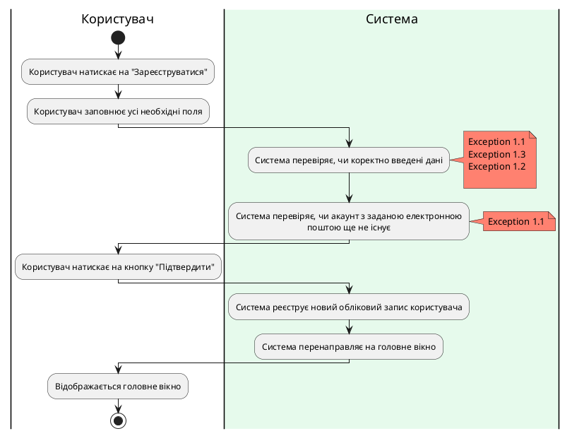
### Процес 2: Вхід користувача в систему
| Поле                | Значення                                                                                  |
|---------------------|-------------------------------------------------------------------------------------------|
| **ID**              | userLogin                                                                                |
| **Назва**           | Авторизація користувача                                                                   |
| **Учасники**        | Користувач (Адміністратор, Експерт), Система                                                                      |
| **Передумови**      | - Користувач має обліковий запис.  - Знати свої облікові дані (email і пароль).       |
| **Результат**       | Користувач успішно увійшов у систему.                                                   |
| **Виключні ситуації**| Exception 2.1 - Неправильні облікові дані.  Exception 2.2 - Забутий пароль.  Exception 2.3 - Проблеми з доступом до сервера.  Exception 2.4 - Користувач не зареєстрований. |
| **Основний сценарій** | 1. Користувач відкриває сторінку входу в систему.  2. Вводить email та пароль.  3. Натискає кнопку "Увійти".  4. Система перевіряє дані.  5. У разі успіху, користувач отримує доступ до свого профілю.|

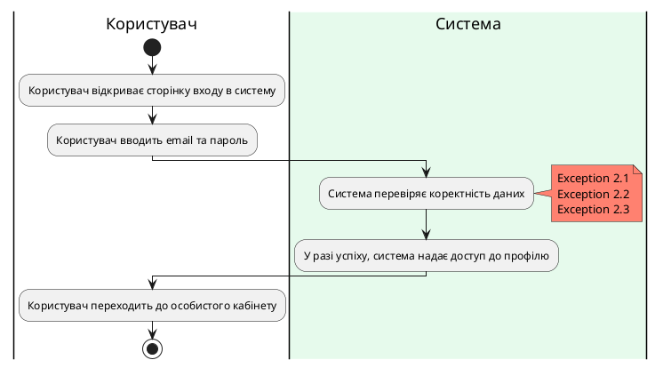
### Процес 3: Оцінка результатів опитувань
| Поле                | Значення                                                                                  |
|---------------------|-------------------------------------------------------------------------------------------|
| **ID**              | surveyResultsEvaluation                                                                   |
| **Назва**           | Оцінка результатів опитувань                                                              |
| **Учасники**        | Адміністратор, Експерт                                                                   |
| **Передумови**      | Опитування завершено з достатньою кількістю відповідей для аналізу.                     |
| **Результат**       | Згенеровано звіт з результатами опитування.                                             |
| **Виключні ситуації**| Exception 3.1 - Відсутність відповідей для аналізу.  Exception 3.1 - Технічні проблеми з відображенням результатів.     |
| **Основний сценарій** | 1. Адміністратор відкриває інтерфейс для перегляду результатів опитувань.  2. Обирає конкретне опитування для аналізу.  3. Система агрегує та обробляє відповіді.  4. Генерується звіт з результатами опитування.  5. Адміністратор може завантажити звіт або надіслати його на електронну пошту.|

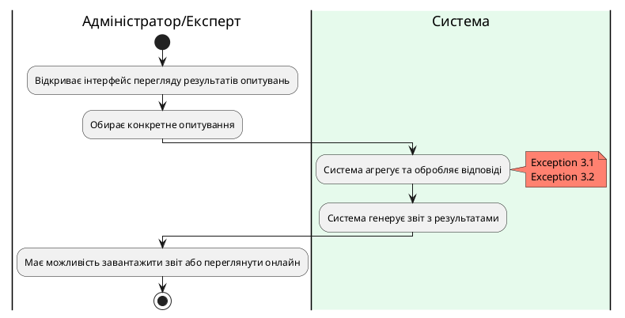
### Процес 4: Проходження опитування

| Поле                | Значення                                                                                  |
|---------------------|-------------------------------------------------------------------------------------------|
| **ID**              | surveyParticipation                                                                      |
| **Назва**           | Проходження опитування                                                                   |
| **Учасники**        | Експерт, Система                                                                         |
| **Передумови**      | - Створено опитування, доступне для участі.  - Експерт отримав доступ до опитування. |
| **Результат**       | Експерт успішно пройшов опитування, відповіді збережено у системі.                      |
| **Виключні ситуації**| Exception 4.1 - Проблеми з доступом до опитування.  Exception 4.2 - Неповне завершення опитування.                   |
| **Основний сценарій** | 1. Експерт відкриває доступне опитування.  2. Ознайомлюється з питаннями.  3. Відповідає на питання.  4. Завершує опитування, натискаючи "Завершити".  5. Система зберігає відповіді та підтверджує завершення. |

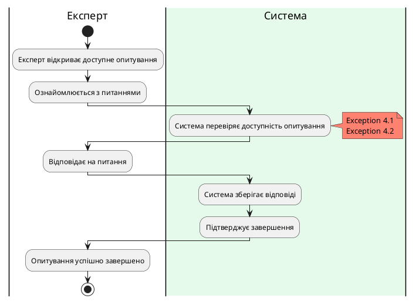
### Процес 5: Створення нової форми опитування
| Поле                | Значення                                                                                  |
|---------------------|-------------------------------------------------------------------------------------------|
| **ID**              | createSurveyForm                                                                          |
| **Назва**           | Створення нової форми опитування                                                         |
| **Учасники**        | Адміністратор, Система                                                                   |
| **Передумови**      | - Адміністратор має обліковий запис.  - Має доступ до інтерфейсу для створення форм.|
| **Результат**       | Нова форма успішно створена та збережена в системі.                                     |
| **Виключні ситуації**| Exception 5.1 - Помилки при збереженні.  Exception 5.2 - Неповна інформація при заповненні форми.  Exception 5.3 - Проблеми із сервером.|
| **Основний сценарій** | 1. Адміністратор відкриває інтерфейс для створення нової форми.  2. Вводить назву та опис форми.  3. Додає необхідні поля (текстові поля, радіо-кнопки тощо).  4. Налаштовує валідацію полів і стиль форми.  5. Зберігає форму.|

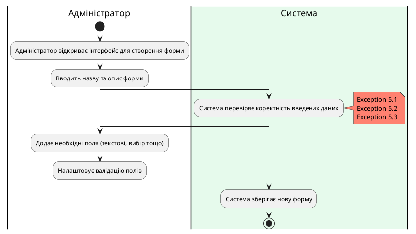
### Процес 6: Редагування існуючої форми опитування

| Поле                | Значення                                                                                  |
|---------------------|-------------------------------------------------------------------------------------------|
| **ID**              | editSurveyForm                                                                            |
| **Назва**           | Редагування існуючої форми                                                                |
| **Учасники**        | Адміністратор, Система                                                                   |
| **Передумови**      | Існуюча форма потребує змін                                                               |
| **Результат**       | Зміни успішно збережено, форма оновлена                                                 |
| **Виключні ситуації**| Exception 6.1 - Конфлікти версій при редагуванні.  Exception 6.2 - Помилки під час збереження змін.| 
| **Основний сценарій** | 1. Адміністратор відкриває список форм.  2. Обирає форму для редагування.  3. Вносить зміни (додає/видаляє поля).  4. Зберігає оновлену форму.|

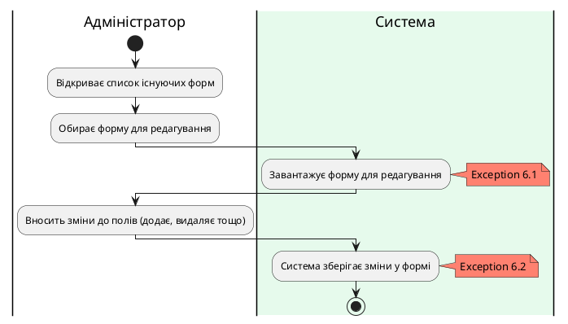
### Процес 7: Публікація форми опитування
| Поле                | Значення                                                                                  |
|---------------------|-------------------------------------------------------------------------------------------|
| **ID**              | publishSurveyForm                                                                         |
| **Назва**           | Публікація форми опитування                                                               |
| **Учасники**        | Адміністратор, Система                                                                   |
| **Передумови**      | Форма готова до публікації                                                                |
| **Результат**       | Форма успішно опублікована та доступна для користувачів                                   |
| **Виключні ситуації**| Exception 7.1 - Недоступність сервера під час публікації.  Exception 7.2 - Відсутність прав на публікацію.| 
| **Основний сценарій** | 1. Адміністратор відкриває список створених форм.  2. Обирає форму, яку необхідно опублікувати.  3. Перевіряє налаштування форми та вносить необхідні зміни (за потреби).  4. Надає дозвіл на публікацію форми.  5. Система перевіряє доступність сервера та права адміністратора.  6. Форма успішно публікується та стає доступною користувачам.|

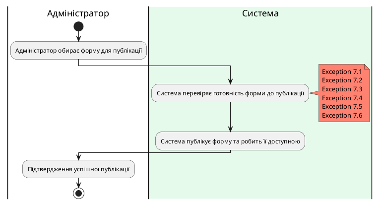
